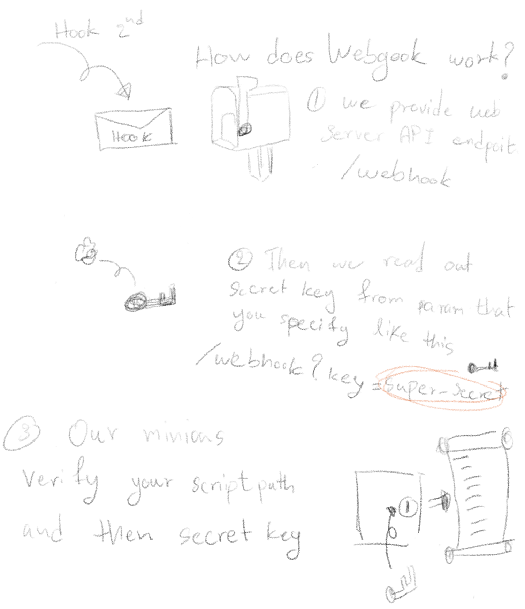

# Webgook
[](https://goreportcard.com/report/github.com/gogetth/webgook)
[](https://godoc.org/github.com/gogetth/webgook)

Simple webhook deployment on Golang

Webgook (pronounce : web-go-ok) use for running script when we have some trigger from webhook such as CI/CD. By using golang to serve API endpoint and then run some script. This project enhance your automatic deploy pipeline.

## Architecture

When user push code to remote repository (such Github or Gitlab) then CI/CD (such Travis or Jenkins) will be triggered from webhook after that the application will  be deploy (by run script on Webgook server) by 2nd webhook which triggering some shell script.

## How does Webgook work

When we running Webgook with command like this

```
$ ./webgook -port 8080 -script test.sh -key super-secret-key
```

so that you have to trigger endpoint after your build pipeline alredy done.


```
GET <your-server-ip>:<your-server-port>/webhook?key=super-secret-key
```

## How to run Webgook
You can run Webgook by building from source or Docker image. However we recommended to run on Docker. Due to complexity of running on startup and fault tolerance mechanism, init system will take care of Docker and then Docker will take care of your Webgook container.


And please make sure your desired to run script can be excecute. And if you went to know all of parameters to control Webgook you can run.

```
$ ./webgook -help
Usage of ./webhook:
  -ip string
    	Specify ip address if you want
  -key string
    	Specify secret key by this flag (default "super-secret-key")
  -port string
    	Specify port (default "9000")
  -script string
    	You must specify script
```


### Running from source
If you want to building from source you have to install golang `dep` for dependencies management. And you new to following these steps.

1) get source from repository.

```
$ go get github.com/gogetth/webgook
```

2) resolve dependencies

```
$ dep ensure
```

3) building

```
$ go build -o webhook .
```

4) running script like this

```
$ ./webgook -port 8080 -script test.sh -key super-secret-key
```

### Running from docker image

Even though we use Docker, but we can control or even start new contaier outside the container by using sibling technique. In order to do so we have to mount valume `/var/run/docker.sock` to container and mount script we are desired to run to container such `demo.sh`

```
$ docker run -d -v /var/run/docker.sock:/var/run/docker.sock -v /home/nc-user/demo.sh:/demo.sh --restart=always aorjoa/webgook -script /demo.sh -key this-is-super-secret-key
```

command explaination

```
docker run -d
   : run Docker container with deamon mode
-v /var/run/docker.sock:/var/run/docker.sock
   : mount sock to container, so we can sibling deploy
-v /home/nc-user/demo.sh:/demo.sh 
   : mount script to container
--restart=always
   : this Webgook container will always try to run.
-script /demo.sh
   : Webgook parameter to specify what script you desired.
-key this-is-super-secret-key
   : Webgook parameter which we use to verify the hook be being legally.
```

#### Thank you session
We would like to thank you to [Nipa.cloud](https://www.nipa.cloud/) and [ODDS](https://medium.com/odds-team) for support resource that we use to play :)


